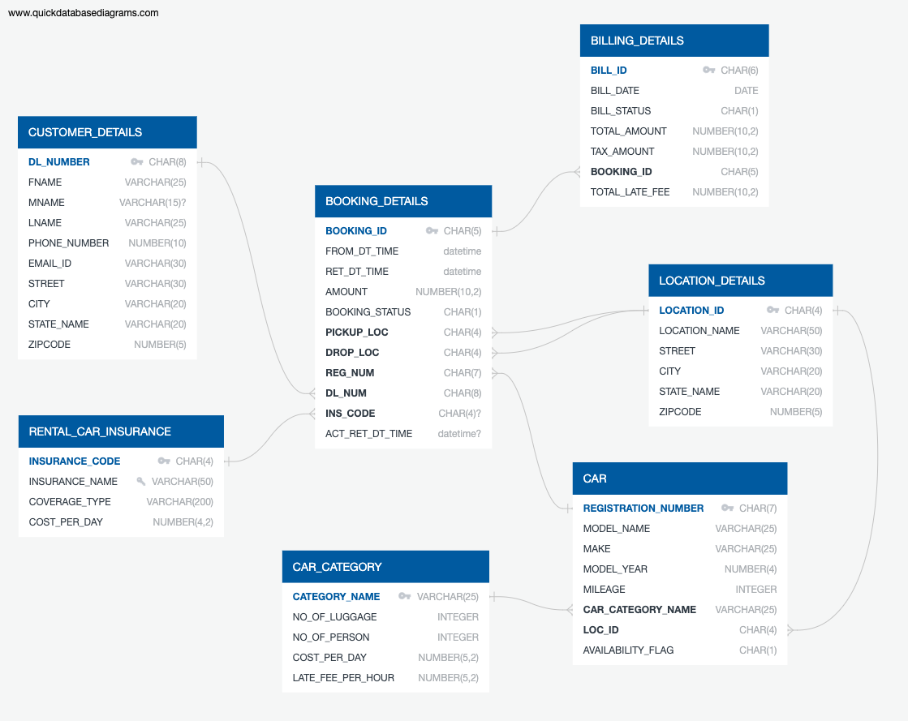
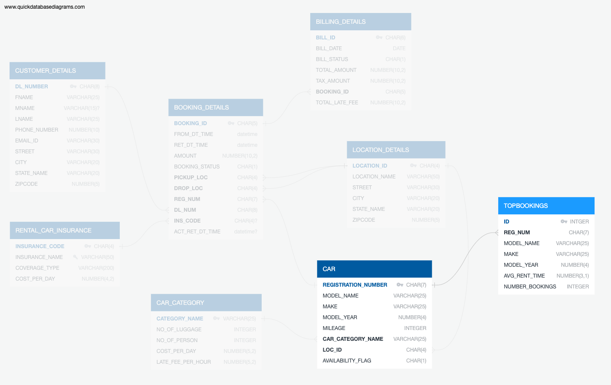
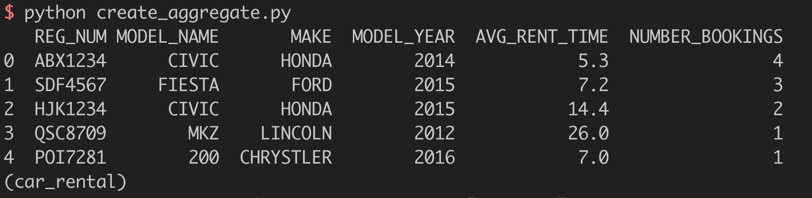
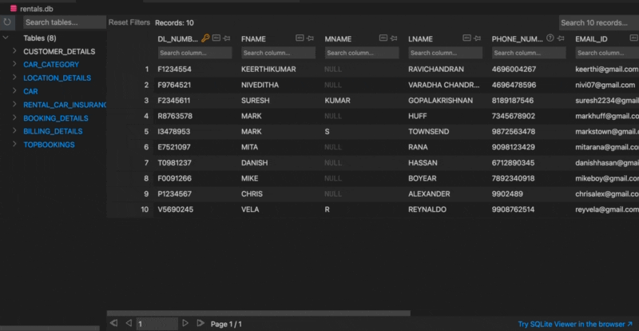

# Diseño de Base de Datos y ETL para servicio de renta de vehículos en México
---

El siguiente repositorio contiene dos scripts en Python:

1. `create_db.py` que crea la base de datos `rentals.db` con la que vamos a estar trabajando apartir del archivo SQL `create_db.sql` y, 
2. `create_aggregate.py` que realiza las tareas de ETL para crear y agregar una nueva tabla a nuestra base de datos (`rentals.db`) con los vehículos mas reservados.

## Requisitos e instalacion

```python
python==3.8.12
pandas==1.4.0
pysqlite3==0.4.6
```

Para generar el archivo `rentals.db` con la base de datos, ejecuta en la linea de comandos,

```bash
> python create_db.py
```

Para crear la tabla agregada `TOPBOOKINGS` dentro de la base de datos, ejecuta en la linea de comandos,
```bash
> python create_aggregate.py
```

## Base de datos de renta de vehículos
---

La base de datos contiene 7 tablas o caracteristicas principales para la organización de un sistema de renta de vehículos:

- **CUSTOME_DETAILS**: detalles del cliente como nombre, appellido, teléfono, email y, direción.
- **CAR**: detalles de los coches disponibles a rentar como Modelo, Marca, Año, Kilometraje, categoría por tamaño, establecimiento y, disponibilidad.
- **CAR_CATEGORY**: categorias de los vehículos por tamaño que incluye especificaciones como capacidad de equipaje, capacidad de personas, costo por dia e, impuestos por pago tardío.
- **LOCATION_DETAILS**: nombre y dirección de los distintos establecimientos de renta de vehículos.
- **RENTAL_CAR_INSURANCE**: detalles de los seguros disponibles como nombre, tipo de cobertura y, costo.
- **BOOKING_DETAILS**: detalles de la reserva de los vehículos como fecha estimada de salida y regreso, monto a pagar, estado de la reserva (B:booked, R:returned, C:cancelled), establecimiento de salida, establecimiento de regreso, ID del vehículo, ID del cliente, ID del seguro y, fecha registrada de regreso del vehículo.
- **BILLING_DETAILS**: detalles del recibo para vehículos con estado de la reserva como returned (R) que incluye fecha, estado del pago, monto, monto de los inpuestos, ID de la reserva y, total a pagar.

Los detalles de cada columna dentro de estas tablas como lo es el tipo de dato y las relaciones entre estas (Primary Keys y Foreign Keys) se pueden apreciar en el siguiente esquema.



## Diseño e implementacion de ETL para crear una tabla agregada a la base de datos
---

Lo siguiente es diseñar e implementar un modelo ETL para crear una tabla agregada a la base de datos con con los vehículos mas reservados. El modelo ETL se divide en 3 pasos:

1. Conectarnos a la base de datos para extraer la información. Esto esta dado por la funcion.
   
   ```Python
   def create_connection(db_file):
   ```
2. Hacer un SQL query en la base de datos para extraer y transformar información de los vehículos reservados (`BOOKINGS_DETAILS`), agrupamos por el ID de los vehículos (`REG_NUM`), contamos cuantas veces ha sido reservado cada vehículo (`NUMBER_BOOKINGS`) y encontramos el promedio en dias de la diferencia entre la fecha de salida y la de regreso (`AVG_RENT_TIME`). Finalmente, unimos con la tabla de los vehículos (`CAR`) para obtener el modelo (`MODEL_NAME`), la marca (`MAKE`) y el año (`MODEL_YEAR`). El siguiente SQL hace todo lo mencionado.

```sql
SELECT REG_NUM, MODEL_NAME, MAKE, MODEL_YEAR, ROUND(AVG(ABS(JULIANDAY(RET_DT_TIME) - JULIANDAY(FROM_DT_TIME))), 1), COUNT(*) as NBOOKINGS FROM BOOKING_DETAILS as bd
                   JOIN CAR AS c ON c.REGISTRATION_NUMBER == bd.REG_NUM
                   GROUP BY REG_NUM
                   ORDER BY NBOOKINGS DESC
```
3. Finalmente creamos la tabla agregada que lleva por nombre `TOPBOOKINGS` y posteriormente la llenamos con el query anterior. Si la tabla `TOPBOOKINGS` ya existiese, esta se elimina y se crea una nueva con la información actualizada. A continuación se muestra el código sql para generar la tabla `TOPBOOKINGS`.

```sql
CREATE TABLE IF NOT EXISTS TOPBOOKINGS (
                                        id integer PRIMARY KEY,
                                        REG_NUM CHAR(7) NOT NULL,
                                        MODEL_NAME VARCHAR(25) NOT NULL,
                                        MAKE VARCHAR(25) NOT NULL,
                                        MODEL_YEAR NUMBER(4) NOT NULL,
                                        AVG_RENT_TIME NUMBER(3,1) NOT NULL,
                                        NUMBER_BOOKINGS INTEGER NOT NULL
);
```
El esquema de la tabla agregada `TOPBOOKINGS` se muestra a continuación.



El script `create_aggregate.py`, además de la tabla agregada, imprime el contenido de esta en la linea de comandos que luce de la siguiente forma.



El contenido de la base de datos `rentals.db`, incluida la tabla agregada `TOPBOOKINGS`, lucen de la siguiente forma.



## Notas
---
Si bien el proceso ETL llevado acabo es simple, el código sirve de estructura para transformaciones y creacion de tablas agregadas mas complicadas. Podriamos por ejemplo, obtener información del vehículo mas rentado por establecimiento de partida (`PICKUP_LOC`), o bien, ver cuales son las ciudades que mas ingresos generan. Para realizar estos ejemplos la estructura del código se mantiene casi intacta, la modificacion principal esta en el código SQL dentro de la siguiente función.

```python
def query_save_topbookings(conn):
```
